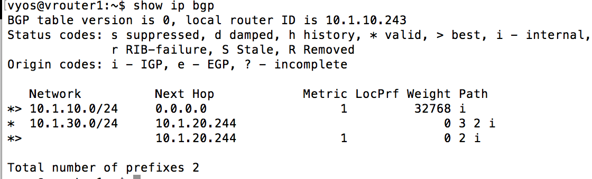
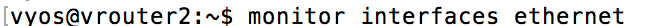
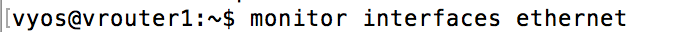
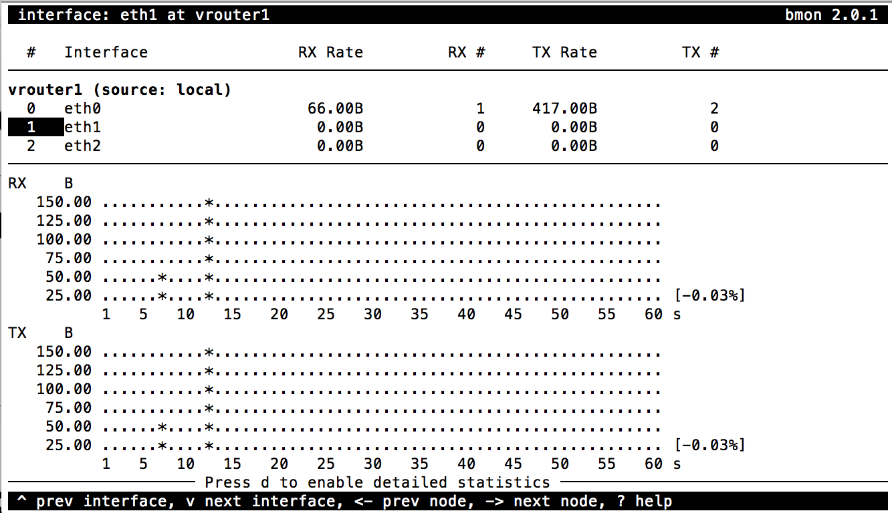
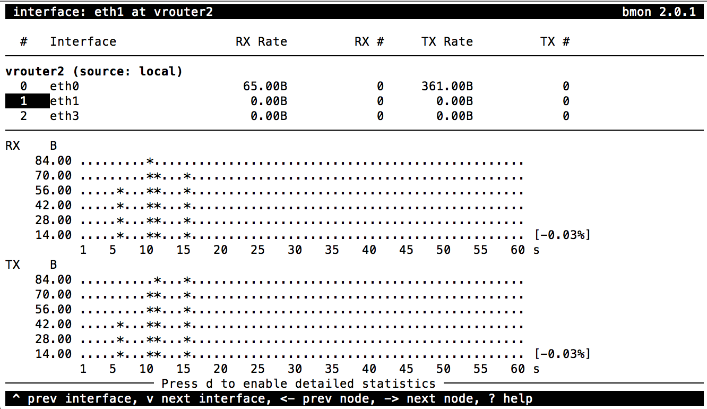
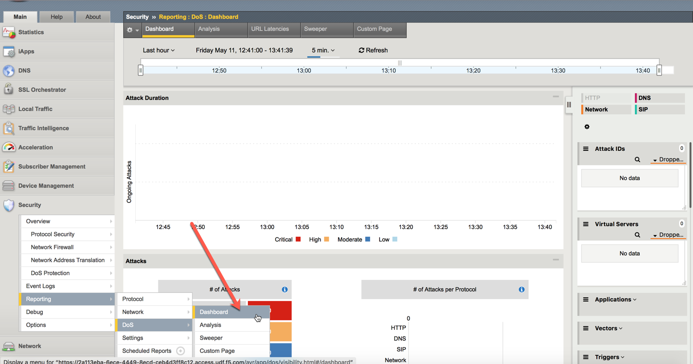
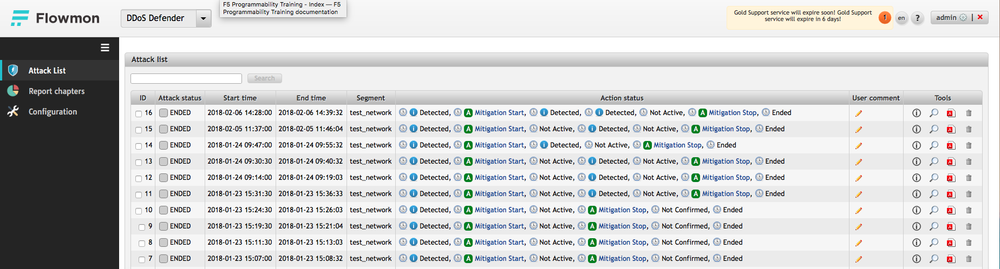

Prepare traffic visualization and monitoring
============================================

- Connect to Ubuntu jumphost using RDP 

- Open SSH connections to Router1 and Router2

-  Verify Router1 BGP configuration
    ``show ip bgp``

        |image3|

-  Start interface monitoring in Router1 and Router2

    |image5|\ |image6|\ |image4|

    |image7|

-  Select *eth1* and press ``g`` to enable graphic mode

-  Open **DoS Visibility Dashboard** in AFM TMUI

    |image8|

-  Open **DDoS Defender --> Attack List** in Flowmon WebUI

    |image9|

